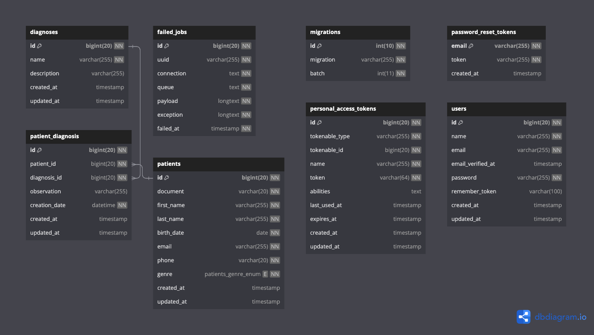

<p align="center"></p>

## Requirements
- PHP >= 8.1
- Ctype PHP Extension
- cURL PHP Extension
- DOM PHP Extension
- Fileinfo PHP Extension
- Filter PHP Extension
- Hash PHP Extension
- Mbstring PHP Extension
- OpenSSL PHP Extension
- PCRE PHP Extension
- PDO PHP Extension
- Session PHP Extension
- Tokenizer PHP Extension
- XML PHP Extension

Review more info in official documentation in [laravel.com](https://laravel.com/docs/10.x/deployment#server-requirements)

## Installation

Run:

```cmd
composer install
cp .env.example .env
php artisan key:generate
```

Configure vars in .env: database connection, email, etc..

Run
```cmd
php artisan migrate
php artisan db:seed
php artisan serve
```

### Documentation with Swagger

To see the api documentation, run the project with ```php artisan serve``` and then enter the path **http://your_url_project/api/documentation**

## About Project

This is a Laravel a web application framework for REST API with PHP for hospital patient management, which will allow hospital doctors to search for a patient, create new patients and add diagnoses to patients.

## Entity Relationship Model - MER
<p align="center"></p>

## Copyright

[Jorge Ivan Carrillo Gonzalez](https://www.linkedin.con/in/jorgecarrillog)

## License

The Laravel framework is open-source software licensed under the [MIT license](https://opensource.org/licenses/MIT).